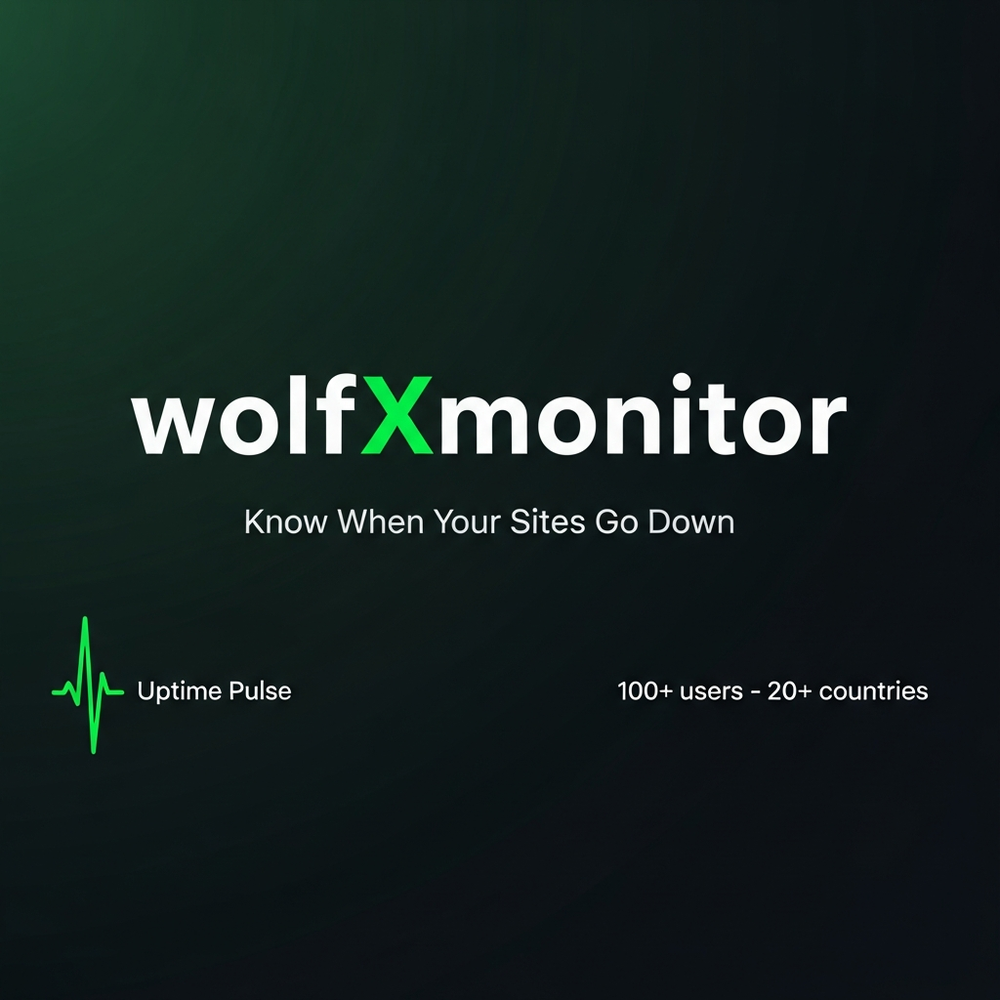

<div align="center">



# wolfXmonitor

**Real-time uptime monitoring for developers and teams.**  
Know the instant your sites go down — before your users do.

[](https://nodejs.org)
[](https://www.typescriptlang.org)
[](https://react.dev)
[](https://www.postgresql.org)
[](LICENSE)
[](https://xcasper.space)

[Live Demo](https://monitor.xwolf.space) · [Report Bug](https://github.com/WOLFTECH-254/wolfXmonitor/issues) · [Request Feature](https://github.com/WOLFTECH-254/wolfXmonitor/issues)

</div>

---

## What is wolfXmonitor?

wolfXmonitor is a full-stack **SaaS uptime monitoring platform** that pings your websites and APIs every minute and alerts you by email the moment they go down. Built with a dark green aesthetic, it includes multi-user support, Free and Pro subscription tiers via Paystack, Brevo email alerts, a public status page, and a full admin control panel.

Over **100+ wolves** monitoring endpoints from **20+ countries** worldwide.

---

## Features

### Core Monitoring
- **1-minute ping intervals** — checks every URL on your list every 60 seconds
- **Response time tracking** — records latency on every ping for trend analysis
- **Uptime percentage** — rolling 30-day uptime % shown per monitor
- **Incident log** — full history of every outage with duration and timestamps
- **Public status page** — shareable `/status` URL showing live green/red health

### Alerts
- **Email alerts via Brevo** — instant notification when a site goes down or recovers
- **Configurable sender** — admin sets the FROM name, email, and Brevo API key
- **Alert deduplication** — one alert per incident, not one per ping

### Multi-user & Billing
- **Free plan** — up to N monitors (admin-configurable)
- **Pro plan** — unlimited monitors, via Paystack inline checkout
- **M-Pesa support** — Kenyan users see an M-Pesa / Card picker automatically
- **Currency config** — admin sets billing currency (default KES)
- **Paystack webhook verification** — server-side plan activation on payment

### Admin Panel
- User management — view all users, change plans, delete accounts
- Monitor oversight — see every monitor across all users
- Billing settings — Paystack keys, currency, free plan limits
- Email settings — Brevo API key, sender name, and address
- Footer & social links — edit footer content without code
- Country stats — see which countries your users are from

### Design
- Dark green-tinted theme (`hsl(130,12%,4%)` base) throughout
- **Barlow Condensed** display font + **Space Mono** monospace
- Fully responsive — works on mobile, tablet, and desktop
- Animated user counter on landing page (scroll-triggered, ease-out)
- Overlapping country flag stack with live "100+ users · 20+ countries" social proof

---

## Tech Stack

| Layer | Technology |
|-------|-----------|
| Frontend | React 19, Vite, TailwindCSS v4, Wouter, TanStack Query |
| Backend | Node.js 22, Express, Pino logger, Zod validation |
| Database | PostgreSQL 17, Drizzle ORM |
| Auth | Session-based (express-session + connect-pg-simple) |
| Payments | Paystack Inline JS (v1) |
| Email | Brevo (Sendinblue) Transactional API |
| Monorepo | pnpm workspaces |
| Deployment | Nginx reverse proxy + PM2 process manager |

---

## Project Structure

```
wolfxmonitor/
├── artifacts/
│   ├── api-server/          # Express REST API
│   │   └── src/routes/      # auth, monitors, payments, admin, alerts
│   └── uptime-monitor/      # React + Vite frontend
│       └── src/
│           ├── pages/       # landing, dashboard, monitoring, upgrade, admin…
│           ├── components/  # layout, footer, ui primitives
│           └── hooks/       # use-auth, api client hooks
├── lib/
│   ├── db/                  # Drizzle schema, migrations, DB client
│   └── api-client-react/    # Generated React Query hooks from OpenAPI spec
├── scripts/                 # Shared utility scripts
├── pnpm-workspace.yaml
└── README.md
```

---

## Getting Started

### Prerequisites

- Node.js 18+
- pnpm 9+
- PostgreSQL 14+

### Installation

```bash
# Clone the repository
git clone https://github.com/WOLFTECH-254/wolfXmonitor.git
cd wolfxmonitor

# Install all workspace dependencies
pnpm install

# Set up environment variables
cp .env.example .env
# Edit .env with your DATABASE_URL and SESSION_SECRET

# Push the database schema
psql "$DATABASE_URL" < lib/db/migrations/initial.sql

# Start the API server (port 3001)
pnpm --filter @workspace/api-server run dev

# Start the frontend (port 5173)
pnpm --filter @workspace/uptime-monitor run dev
```

### Environment Variables

| Variable | Description | Required |
|----------|-------------|----------|
| `DATABASE_URL` | PostgreSQL connection string | ✅ |
| `SESSION_SECRET` | Secret for signing sessions | ✅ |
| `BREVO_API_KEY` | Brevo transactional email API key | For email alerts |

> Paystack keys and Brevo settings are stored in the database via the Admin Panel — not in environment files.

---

## Admin Setup

1. Register the first account — it automatically becomes the admin.
2. Navigate to `/admin`
3. Under **Payments**, enter your Paystack public and secret keys and set the billing currency.
4. Under **Email**, enter your Brevo API key, sender name, and verified sender email.
5. Under **Settings**, configure the free plan monitor limit.

---

## API Overview

| Method | Endpoint | Description |
|--------|----------|-------------|
| `POST` | `/api/auth/register` | Register a new user |
| `POST` | `/api/auth/login` | Log in |
| `GET` | `/api/auth/me` | Current session user |
| `GET` | `/api/monitors` | List user's monitors |
| `POST` | `/api/monitors` | Create a monitor |
| `DELETE` | `/api/monitors/:id` | Delete a monitor |
| `POST` | `/api/monitors/:id/ping` | Manually trigger a ping |
| `GET` | `/api/dashboard/summary` | Uptime stats summary |
| `GET` | `/api/status` | Public status page data |
| `GET` | `/api/payments/config` | Paystack config + user country |
| `POST` | `/api/payments/verify` | Verify Paystack payment & activate Pro |
| `GET` | `/api/stats/countries` | Public user country distribution |

---

## Deployment

### VPS (Nginx + PM2)

```bash
# On your VPS
git clone https://github.com/WOLFTECH-254/wolfXmonitor.git /var/www/wolfxmonitor
cd /var/www/wolfxmonitor
pnpm install
pnpm --filter @workspace/uptime-monitor run build

# Create ecosystem.config.js for PM2
# Start API server
pm2 start ecosystem.config.js --env production
pm2 save

# Configure Nginx reverse proxy
# → Frontend static files served from artifacts/uptime-monitor/dist
# → /api/* proxied to API server port
```

### Nginx Sample Config

```nginx
server {
    listen 80;
    server_name yourdomain.com;

    root /var/www/wolfxmonitor/artifacts/uptime-monitor/dist;
    index index.html;

    location / {
        try_files $uri $uri/ /index.html;
    }

    location /api {
        proxy_pass http://localhost:3001;
        proxy_http_version 1.1;
        proxy_set_header Upgrade $http_upgrade;
        proxy_set_header Connection 'upgrade';
        proxy_set_header Host $host;
        proxy_set_header X-Real-IP $remote_addr;
        proxy_cache_bypass $http_upgrade;
    }
}
```

---

## Screenshots


---

## Roadmap

- [ ] Slack / Discord webhook alerts
- [ ] Custom ping intervals (5 min, 15 min, 30 min)
- [ ] Multi-region pings (US, EU, Africa)
- [ ] SSL certificate expiry monitoring
- [ ] API key authentication for programmatic access
- [ ] Team accounts with multiple members

---

## Contributing

Pull requests are welcome. For major changes, please open an issue first to discuss what you'd like to change.

```bash
# Fork and clone
git checkout -b feature/your-feature
git commit -m "feat: your feature"
git push origin feature/your-feature
# Open a pull request
```

---

## License

MIT © [WOLF TECH · Silent Wolf](https://xcasper.space)

---

<div align="center">

**Powered by WOLF TECH · Silent Wolf**  
Built in Nairobi, Kenya 🇰🇪 — watched from 20+ countries worldwide.

</div>
